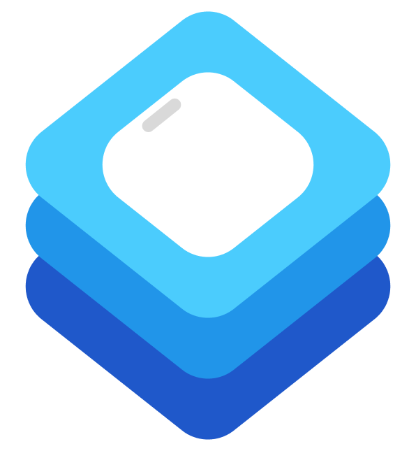

# DrawerKit
<p>
    
</p>


**DrawerKit** is a lightweight and customizable Swift package that provides smooth, animated bottom drawers for iOS applications. It simplifies the process of adding a modern drawer interface with a few lines of code.

## Features
- **Smooth slide-up animation**
- **Swipe to dismiss with spring effect**
- **Customizable height and content**
- **Supports safe area insets for iPhones with home indicators**

## Installation

### Swift Package Manager
To install DrawerKit, follow these steps:
1. In Xcode, go to **File > Add Packages...**
2. Enter the GitHub URL for the DrawerKit repository:
3. Select the version and add it to your project.

## Usage

### Basic Example

Here’s how you can use `DrawerView` in your SwiftUI project:

```swift
import SwiftUI
import DrawerKit

struct ContentView: View {
 @State private var showDrawer = false

 var body: some View {
     ZStack {
         Color.gray.opacity(0.3)
             .ignoresSafeArea()

         Button("Toggle Drawer") {
             withAnimation {
                 showDrawer.toggle()
             }
         }
         .font(.headline)
         .foregroundColor(.white)
         .padding()
         .background(Color.blue)
         .cornerRadius(12)

         DrawerView(isPresented: $showDrawer, heightRatio: 0.4) {
             VStack {
                 Text("Drawer Content")
                     .font(.title)
                     .padding(.bottom, 10)
                 Button("Close Drawer") {
                     withAnimation {
                         showDrawer = false
                     }
                 }
             }
         }
     }
 }
}
