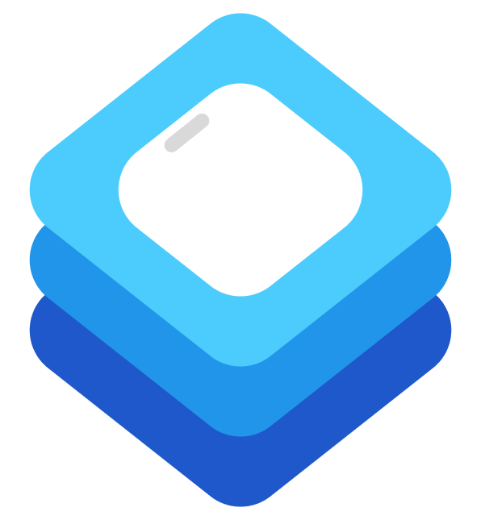

# DrawerKit

<p>
    
</p>

SwiftUI bottom drawers for iOS 26 with content-fitting height, max-height detents, live drag physics, rubber-band resistance, liquid-glass styling, and a sheet-like modifier API.

## Features

- Interactive drag-to-dismiss with snap-back
- Rubber-band resistance when over-dragging
- Content, fractional, and fixed-height detents
- Content-fitting drawer height with automatic scrolling past max height
- Customizable style, grabber, dimmed backdrop, and content padding
- Liquid-glass default styling with material, translucency, and subtle border
- Optional image-grid example component with custom detail content

## Installation

Add this repository in Xcode with **File > Add Packages...**, then add `DrawerKit` to your app target.

## Basic Usage

```swift
import SwiftUI
import DrawerKit

struct ContentView: View {
    @State private var showDrawer = false

    var body: some View {
        Button("Open Drawer") {
            showDrawer = true
        }
        .drawer(isPresented: $showDrawer, detent: .content) {
            VStack(alignment: .leading, spacing: 12) {
                Text("Drawer Content")
                    .font(.title)

                Text("This drawer hugs content and scrolls if it exceeds the max height.")
            }
        }
    }
}
```

## Direct Drawer

```swift
DrawerView(
    isPresented: $showDrawer,
    detent: .fraction(0.55),
    showsDimmedBackground: true,
    sizesToFitContent: true
) {
    VStack(alignment: .leading, spacing: 12) {
        Text("Custom Drawer")
        Button("Close") { showDrawer = false }
    }
}
```

## Detents

```swift
.content        // Hug content up to the max safe height
.fraction(0.6)  // Cap at 60% of available height
.height(420)    // Cap at a fixed height
```

## Styling

```swift
let style = DrawerStyle(
    cornerRadius: 34,
    horizontalPadding: 8,
    bottomPadding: 8,
    usesLiquidGlass: true,
    contentPadding: EdgeInsets(top: 0, leading: 12, bottom: 16, trailing: 12)
)
```

## Image Drawer Example

`MorphingImageDrawerView` is an example component built on top of `DrawerView`. It accepts custom thumbnail and detail builders.

```swift
MorphingImageDrawerView(
    isPresented: $showDrawer,
    selectedItemID: $selectedItemID,
    items: items,
    style: style
) { item in
    AsyncImage(url: item.imageURL) { image in
        image.resizable().scaledToFill()
    } placeholder: {
        Color.gray.opacity(0.24)
    }
} detail: { item in
    VStack(alignment: .leading, spacing: 14) {
        Text(item.title).font(.title)
        Text(item.text)
        Button("Continue") {}
    }
}
```

## Requirements

- iOS 26+
- macOS 26+
- SwiftUI
